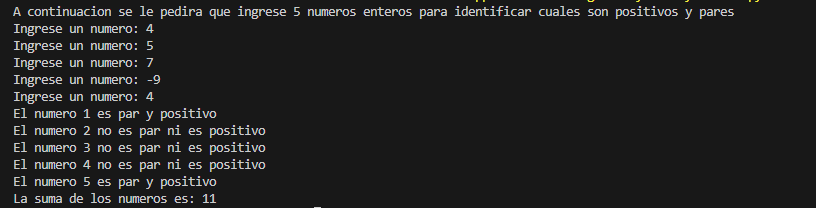
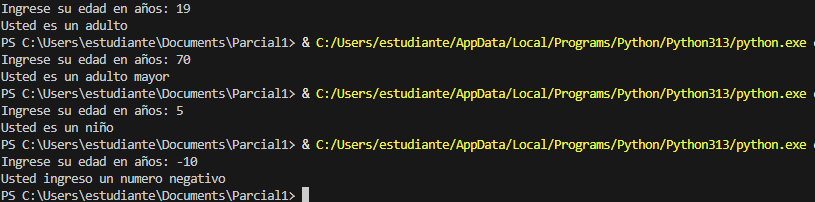
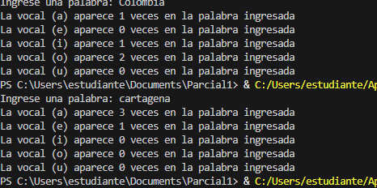

# Parcial 1 - Programación de Computadores
## Docente: Néstor Bolívar 
## Estudiante: Bryan Felipe Jaime Diaz 
## Formato de entrega: Repositorio con resultados y explicación algorítmica.

# Ejercicio 1
## Cree un algoritmo que lea 5 números enteros uno por uno e identifique cuáles son positivos y pares. Al final, debe mostrar la suma total de esos números.
### Para crear este programa se plantea primero pedirle al usuario que ingrese 5 numero por pantalla, luego para evaluar si son positivos y pares, usamos los condicionales y planteamos la condicion de que el numero es positivo si este es mayor que 0, y es par si el modulo entre el numero ingresado y 2 es igual a 0, ya que esto nos indica que el numero es multiplo de 2 ya que nos da residuo 0 al aplicar la division. Se realiza este procedimiento para todos los numeros ingresados y se realiza la suma
# Resultado
 

# Ejercicio 2
## Diseñe un programa que lea la edad de una persona y muestre un mensaje según el siguiente criterio:

## · Menor de 13 años → “Niño”

## · Entre 13 y 17 años → “Adolescente”

## · Entre 18 y 59 años → “Adulto”

## · 60 años o más → “Adulto mayor”
### Para crear este programa usamos condicionales para evaluar los requisitos que se nos piden, evaluando cuando la edad es mayor o igual que 0 y menor 13, esto para identificar si el usuario ingresa un numero negativo(menor que 0), y que cumpla el rango de edad de un niño, se utiliza la misma logica para las demas edades catalagoando cada rango de edad dentro de su respectiva asignacion
# Resultado

# Ejercicio 3
## Solicite al usuario que escriba una palabra (sin espacios) y cuente cuántas vocales tiene. El programa debe ser sensible a mayúsculas y minúsculas (es decir, contar tanto a como A)
### Para crear este programa formamos las variables para cada letra en las cuales se va a almacenar el numero de veces que aparece la subcadena de caracteres evaluada en este caso la vocal en cada caso, para luego imprimir en pantalla el numero de apariciones de cada vocal.
